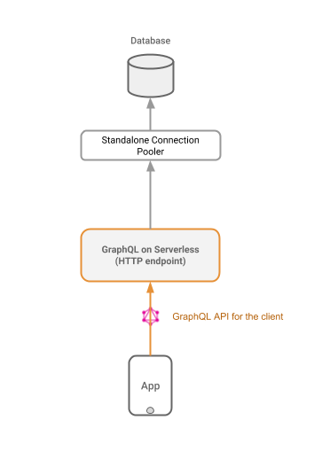

# GraphQL Serverless

This repository contains a set of GraphQL backend boilerplates. These are intended to be useful 
references for setting up a dead-simple GraphQL resolver that can be deployed on a serverless platform
and interact with a database (Postgres).

Each boilerplate comprises of:
1. A basic hello world setup
```
query {
  hello
}
```

2. Query resolvers that fetch from the database
```
query {
  user {
    id
    name
    balance
  }
}
```

3. A Mutation resolver that runs a transaction against the database
```
mutation {
  transferMoney (userFrom, userTo, amount) {
    result
  }
}
```

This repository is organised by the serverless platform and runtime which then breaks down into the GraphQL framework + ORM that is being used. For example, [aws-nodejs/apollo-sequelize](aws-nodejs/apollo-sequelize) is a boilerplate for running a GraphQL API on AWS Lambda with Nodejs using the apollo-server framework and the sequelize ORM.


## Getting Started

Get started with the following languages and serverless platforms:

- [aws-nodejs/apollo-sequelize](aws-nodejs/apollo-sequelize)
- [aws-python/graphene-sqlalchemy](aws-python/graphene-sqlalchemy)
- [aws-go/graphqlgo-gorm](aws-go/graphqlgo-gorm)


## Optional: Scaling database interactions for serverless

In theory, hosting a GraphQL backend on serverless is very useful because serverless gives us a scalable and no-ops platform to deploy "business logic" instantly,

However, serverless backends cannot hold state between different requests because they are destroyed and re-created for every single invocation. This means that our GraphQL backend will cause a database connection to be created and destroyed for every invoation and will result in increased latency and be expensive for the database. A database is optimised for handling upto a few 100 long-living connections, and not a few thousand short-living connections.

#### Connection pooling with pgBouncer

To make our GraphQL backend scale at the same rate as serverless invocations, we will use a standalone connection pooler like [pgBouncer](https://pgbouncer.github.io/) to proxy our connections to the database.



pgBouncer maintains a persistent connection pool with the database but allows applications to create a large number of connections which it proxies to Postgres. We will deploy pgBouncer on a free EC2 instance. We can use the CloudFormation template present in this repo: [cloudformation.json](cloudformation/cloudformation.json) to deploy a pgBouncer EC2 instance in few clicks.

#### Results

Using pgBouncer, here are typical results for corresponding rate of Lambda invocations. The tests were conducted with the `addUser` mutation using [jmeter](https://jmeter.apache.org/).

|  Error Rate -> | Without pgBouncer | With pgBouncer|
| -------------- | ----------------- | ------------- |
| 100 req/s      | 86%               | 0%            |
| 1000 req/s     | 92%               | 4%            |
| 10000 req/s    | NA                | 3%            |

Note: The table above indicates the success (2xx) or failure (non-2xx) of requests when instantiated at X req/s and not the throughput of those requests.

## Using with Hasura GraphQL Engine

You can use these boilerplates to create any kind of GraphQL API. Resolvers that interact with other microservices or  with a database, we started putting together this repository you may wish to merge your schema with [Hasura GraphQL Engine](https://hasura.io) to augment your schema with high-performance CRUD and realtime GraphQL APIs.

Follow this guide to merge your schema with Hasura: [using-with-hasura.md](using-with-hasura.md)

## CONTRIBUTING

We strongly encourage contributions of boilerplates in other languages, frameworks/ORM or serverless platforms. Please follow [CONTRIBUTING.md](CONTRIBUTING.md) for guidelines on contributing.

Check out some of the [open issues](https://github.com/hasura/graphql-serverless/issues?q=is%3Aissue+is%3Aopen+label%3A%22help+wanted%22) which require community help.
